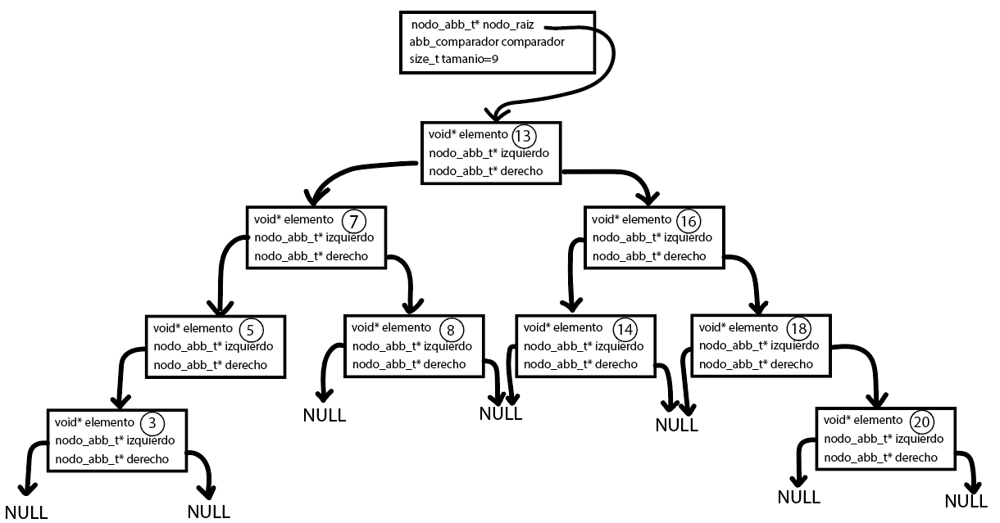
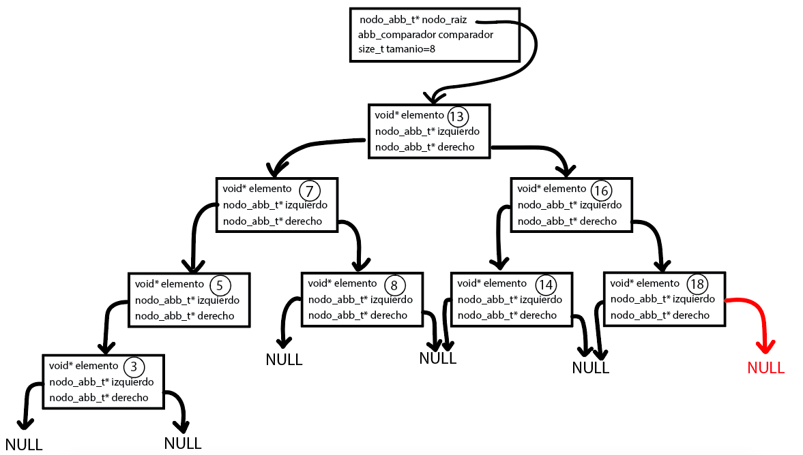
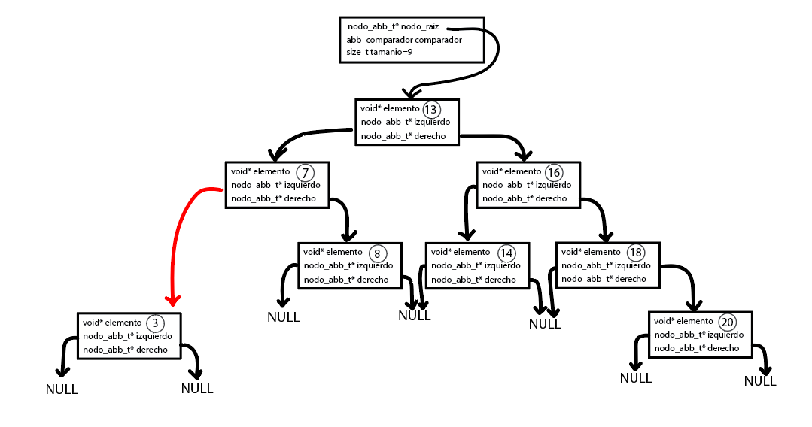
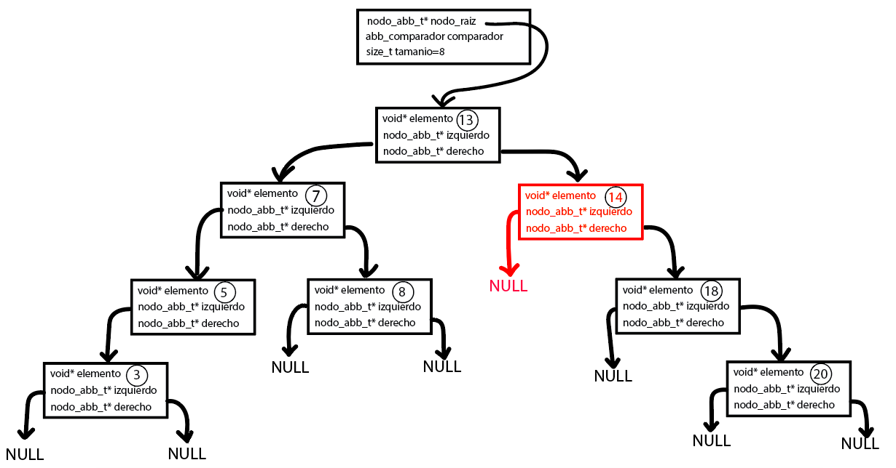
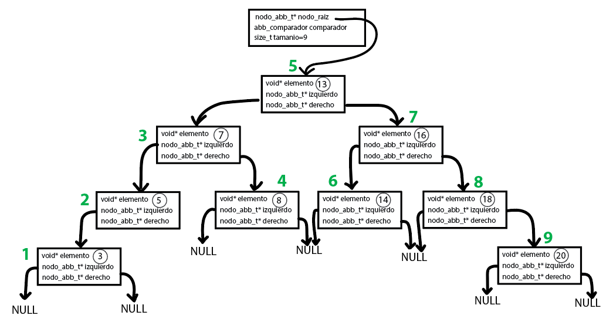
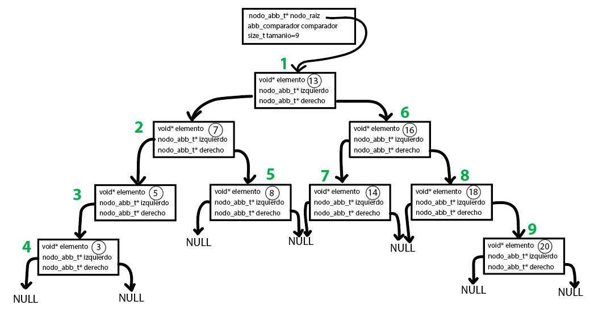
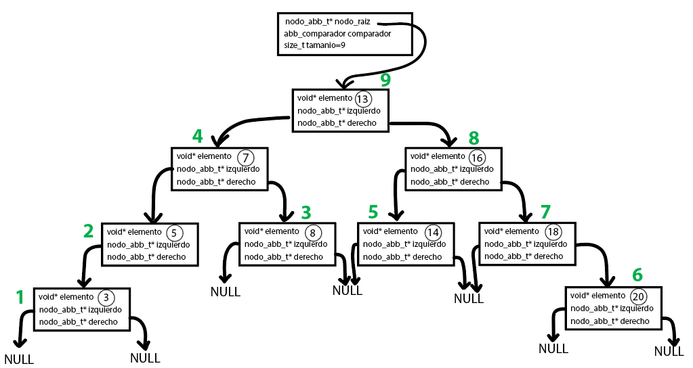
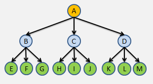
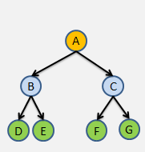

# TDA ABB

## Repositorio de Thiago Fernando Baez - 110703 - thiago_fer2@hotmail.com

- Para compilar:

```bash
make pruebas_chanutron
```

- Para ejecutar:

```bash
./pruebas_chanutron
```

- Para ejecutar con valgrind:
```bash
valgrind ./pruebas_chanutron
```
---
##  Funcionamiento

A continuación, se dará una breve descripción del funcionamiento del TDA Árbol Binario de Búsqueda, sus funciones básicas y como fue implementado en este TP. Se obviará la explicación de funciones como `abb_vacio()` o `abb_tamanio()`, ya que el nombre las describe por sí solas.

Para empezar, el ABB consta de dos estructuras:
- struct nodo_abb: Contiene un void pointer que apunta a la dirección de memoria de un elemento, y a su vez, esta misma estructura es recursiva, teniendo dos struct nodo_abb en su interior: uno apunta a otro nodo situado a la izquierda del nodo actual y el otro apunta a la derecha del nodo actual.
- struct abb: Contiene un puntero al nodo raiz del ABB, un comparador de elementos, el cual recibe dos elementos y devuelve 0 en caso de ser iguales, >0 si el primer elemento es mayor al segundo o <0 si el primer elemento es menor al segundo. Por último, contiene un size_t, que irá almacenando la cantidad de elementos que hay dentro del ABB.

#### abb_crear()

Para esta función, se reserva un bloque de memoria contiguo en el heap, incializando los valores en `0` o `NULL` con `calloc()`. 
Para poder inicializar un ABB, es necesario incluir la función comparadora, así a la hora de insertar claves se tiene una lógica para dividir los elementos ingresados por el usuario.

La complejidad de esta función es obviamente O(1).

#### abb_insertar()

Esta función basicamente inserta los elementos en el lugar que le corresponde del ABB. Va comparando la clave a insertar con el nodo actual. Si el comparador retorna <0, se debe insertar a la izquierda del nodo actual, si retorna >0, debe insertarse a la derecha, y así hasta que se encuentre una hoja o la posición que le corresponda. Esta función fue implementada de forma iterativa, ya que 

La complejidad de insertar en un ABB en promedio es O(log n), donde "n" es el número de nodos que componen el ABB.

En este diagrama se puede observar, que se insertaron 9 elementos. Los números menores al 13 se encuentran en el sub-árbol izquierdo, y los mayores se encuentran en el sub-árbol derecho.

<div align="center">

</div>

#### abb_quitar()

Quizás, esta sea la función mas complicada que se implementó. Se decidió hacerla de manera iterativa, debido a es bastante compleja y la recursividad requiere una buena práctica, resultó más sencillo, con los conocimientos y prácticas presentes, hacerla de forma iterativa para poder tener mejor claridad del código y de lo que se está haciendo. A la hora de quitar o borrar un nodo en un ABB, se pueden tener tres situaciónes distintas:

- 1º Situación: El nodo a eliminar es una "hoja". Esto quiere decír, que el nodo no tiene ningún hijo, ni a su izquierda ni a su derecha (ambos apuntan a `NULL`). Este es el caso más simple. Lo que se hace es guardar en un auxiliar el nodo a eliminar, y apuntar el padre a NULL, ya que como es un nodo hoja, no hay ningún otro por debajo de este. Una vez quitado del árbol, se procede a liberar la memoria que dicho nodo ocupa en el heap, y se reduce el contador de elementos que posee el árbol. En el caso de que el nodo que se quiera eliminar sea la raíz, se debe liberar el nodo raiz y apuntar la misma a `NULL`.
En el diagrama se puede observar como queda, luego de quitarle el 20 al ABB que se muestra en `abb_insertar()`

<div align="center">

</div>

- 2º Situación: El nodo a eliminar posee un hijo. Para quitar el nodo, primero se debe guardar en un puntero auxiliar el nodo a eliminar, y posteriormente apuntar el padre del nodo a eliminar al hijo del nodo a eliminar (se podria pensar de forma más intuitiva como apuntar el abuelo al nieto o con la expresión "el abuelo adopta al nieto"). Pero ante esta situación se presenta otro problema, que es saber a que hijo debe apuntar el padre, por lo que se debe verificar si el nodo izquierdo del padre corresponde con el nodo a eliminar, o de caso contrario, el derecho. Al igual que en la situación del nodo hoja, en el caso particular de que el nodo a eliminar sea la raíz, se debe apuntar esta al hijo del nodo.
En el diagrama se puede observar como queda, luego de quitarle el 5 al ABB que se muestra en `abb_insertar()`

<div align="center">

</div>

- 3º Situación: El nodo a eliminar posee dos hijos. Definitivamente este es el caso más complejo. Para quitar un nodo con dos hijos, se debe guardar la dirección del nodo a eliminar en un puntero auxiliar, y se debe reemplazar el nodo a eliminar por el predecesor inorden. Este sería el valor que le antecede inmediatamente al elemento a quitar del ABB. Un ejemplo sencillo sería que tengamos un abb como el de la figura, y para quitar el número 16 se debe reemplazar en su lugar por el número 14. 
En el diagrama se puede observar como queda, luego de quitarle el 16 al ABB que se muestra en `abb_insertar()`

<div align="center">

</div>

La complejidad de esta operación depende de la estructura del árbol, pero en el peor caso, la eliminación de un nodo puede requerir una complejidad O(n), donde "n" es el número de nodos en el árbol. Sin embargo, en promedio, si el árbol está equilibrado, la eliminación tiene una complejidad de O(log n). Mantener un árbol binario de búsqueda equilibrado o utilizar técnicas de optimización, como árboles AVL o árboles rojo-negro, puede ayudar a garantizar un mejor rendimiento en promedio (No implementamos estos algoritmos pero está bueno saberlo).

#### abb_buscar()

Para buscar elementos en un ABB, se comienza desde el nodo raíz del árbol. Se compara el elemento que se está buscando con el elemento en el nodo raíz. Si el elemento buscado es igual al elemento en el nodo raíz, se ha encontrado lo que se busca y la búsqueda se detiene con éxito. Si el elemento buscado es menor que el elemento en el nodo raíz y el nodo tiene un hijo izquierdo, se pasa al hijo izquierdo y se repite el proceso de comparación en ese subárbol. Si el elemento buscado es mayor que el elemento en el nodo raíz y el nodo tiene un hijo derecho, se pasa al hijo derecho y se repite el proceso de comparación en ese subárbol. Se repite el proceso de comparación y navegación en el subárbol correspondiente (izquierdo o derecho) hasta encontrar el nodo que contiene el elemento buscado o hasta llegar a un nodo que no tiene hijos en la dirección adecuada. Si llegas a un nodo sin hijos y aún no has encontrado el elemento, eso significa que el elemento no existe en el árbol y se retorna NULL.

La complejidad computacional de buscar un elemento en un ABB depende de la estructura del árbol y puede variar desde el mejor caso hasta el peor caso:

- Mejor Caso: El mejor caso ocurre cuando el elemento que estás buscando se encuentra en el nodo raíz del árbol. La búsqueda se resuelve en un solo paso, lo que da una complejidad O(1).

- Caso Promedio: Cuando el árbol está equilibrado y los elementos se distribuyen de manera uniforme, la búsqueda tiene una complejidad O(log n). Esto se debe a que, en cada nivel del árbol, puedes descartar aproximadamente la mitad de los nodos como resultado de la propiedad de un ABB, donde los nodos a la izquierda son menores que el nodo raíz y los nodos a la derecha son mayores.

- Peor Caso: El peor caso ocurre cuando el árbol no está equilibrado, con todos los nodos dispuestos en una sola rama. En este caso, la búsqueda requerirá recorrer todos los nodos desde la raíz hasta el nodo deseado, lo que resulta en una complejidad O(n).

#### abb_destruir()

Esta función fue implementadad de forma recursiva. Se recorre el ABB de manera postorden, eliminando los nodos y luego eliminando el ABB completo. La complejidad de esta operación es O(n) ya que si o si hay que recorrer todos los elementos presentes en el ABB.

#### abb_con_cada_elemento()

Esta función fue implementada de forma recursiva. Recorre el arbol e invoca la función con cada elemento almacenado en el mismo como primer parámetro. El puntero aux se pasa como segundo parámetro a la función. Si la función devuelve false, se finaliza el recorrido aun si quedan elementos por recorrer. Si devuelve true se sigue recorriendo mientras queden elementos. Recorrido especifica el tipo de recorrido a realizar. Devuelve la cantidad de veces que fue invocada la función. La complejidad de esta función depende de la funcion iteradora, hasta cuando se deje de iterar. El peor caso es que se recorran todos los elementos, lo que la complejidad será O(n).


#### abb_recorrer

Esta función se encarga de recorrer todo el ABB según un recorrido especificado por el usuario y va almacenando los elementos en el array hasta completar el recorrido o quedarse sin espacio enel array. Los posibles recorridos son: 
- INORDEN: Se visita primero el nodo izquierdo, segundo el nodo actual y por último el nodo derecho. Se indica en color verde el orden en el que se recorre cada elemento.

<div align="center">

</div>

- PREORDEN: Se visita primero el nodo actual, segundo el nodo izquierdo y por último el nodo derecho. Se indica en color verde el orden en el que se recorre cada elemento.
<div align="center">

</div>

- POSTORDEN: Se visita primero el nodo izquierdo, segundo el nodo derecho y por último el nodo actual. Se indica en color verde el orden en el que se recorre cada elemento.
<div align="center">

</div>

El array tiene un tamaño maximo especificado por tamanio_array.
Devuelve la cantidad de elementos que fueron almacenados exitosamente en el array.

En todos los casos, la complejidad se mantiene en O(n) porque visitas cada nodo exactamente una vez. No importa si se elige inorden, postorden o preorden, ya que la cantidad total de operaciones requeridas para visitar y almacenar todos los elementos en el array es proporcional al número de nodos en el árbol.

En el caso de que se tenga un array mas chico que la cantidad de elementos que contiene el ABB, se podría decir que la complejidad sería O(tam_array), es decir, se recorrería la cantiadad de elementos igual al tamaño del array.

---

## Respuestas a las preguntas teóricas

-   Explique teóricamente qué es una árbol, árbol binario y árbol
    binario de búsqueda. Explique cómo funcionan, cuáles son sus operaciones básicas
    (incluyendo el análisis de complejidad de cada una de ellas) y por qué es
    importante la distinción de cada uno de estos diferentes tipos de
    árboles. Ayúdese con diagramas para explicar.

Para cantidades grandes o muy grandes de datos, el tiempo de acceso a los datos lineal (O(n)) de las listas enlazadas es muy ineficiente. Para ello es necesario trabajar con una estructura de datos capaz de reducir el tiempo de acceso a los mismos, para este fin se trabajará con una estructura llamada árbol, cuyo tiempo de acceso promedio a los datos es de O(logN).

Un árbol es una estructura de datos jerárquica que consta de una colección de nodos, que a su vez, pueden estar conectados a otros múltiples nodos. Un árbol consiste de un nodo principal llamado raiz, y cero o muchos subárboles no vacíos, cada uno de ellos con su raíz conectada mediante un vértice al nodo raíz.
Cada nodo puede tener cero o más nodos hijos, y un nodo que no tiene hijos se llama hoja.

Nacen de la necesidad de representar una jerarquía en la estructura de los datos, asi como tambien
de querer optimizar la búsqueda lineal de una lista.

<div align="left">

</div>


Árbol Binario:

Un árbol binario es un tipo de árbol en el que cada nodo tiene como máximo dos hijos, que se denominan "hijo izquierdo" y "hijo derecho".
En un árbol binario, un nodo puede tener 0, 1 o 2 hijos.
Los árboles binarios se utilizan en aplicaciones donde se necesita una estructura de árbol jerárquica con un máximo de dos ramas en cada nodo, como la estructura de directorios en un sistema de archivos.
Estos árboles están íntimamente relacionados a las operaciones de búsqueda, con el objetivo de aproximarse a la búsqueda binaria.

<div align="left">

</div>


Árbol Binario de Búsqueda:

Un árbol binario de búsqueda es un tipo específico de árbol binario con la propiedad adicional de que cada nodo tiene un valor asociado, y los valores en el subárbol izquierdo de un nodo son menores que el valor del nodo, mientras que los valores en el subárbol derecho son mayores.
Esta propiedad garantiza que los elementos estén organizados de manera que se puedan buscar, insertar y eliminar eficientemente.
Los árboles binarios de búsqueda son utilizados comúnmente como estructuras de datos para implementar diccionarios, conjuntos y otras estructuras en las que se requiere una rápida búsqueda y recuperación de datos.

Las funciones que tienen todos estos tipos son:

- Crear
- Destruir
- Insertar
- Borrar
- Buscar
- Vacio
- Recorrer

IMPORTANTE: EL ANÁLISIS DE COMPLEJIDAD DE CADA UNA DE LAS FUNCIONES BÁSICAS SE ENCUENTRA DETALLADO EN EL FUNCIONAMIENTO DEL TP.

-   Explique su implementación y decisiones de diseño (por ejemplo, si
    tal o cuál funciones se plantearon de forma recursiva, iterativa o
    mixta y por qué, que dificultades encontró al manejar los nodos y
    punteros, reservar y liberar memoria, etc).

    Estas explicaciónes ya se hicieron en el funcionamiento del TP.
